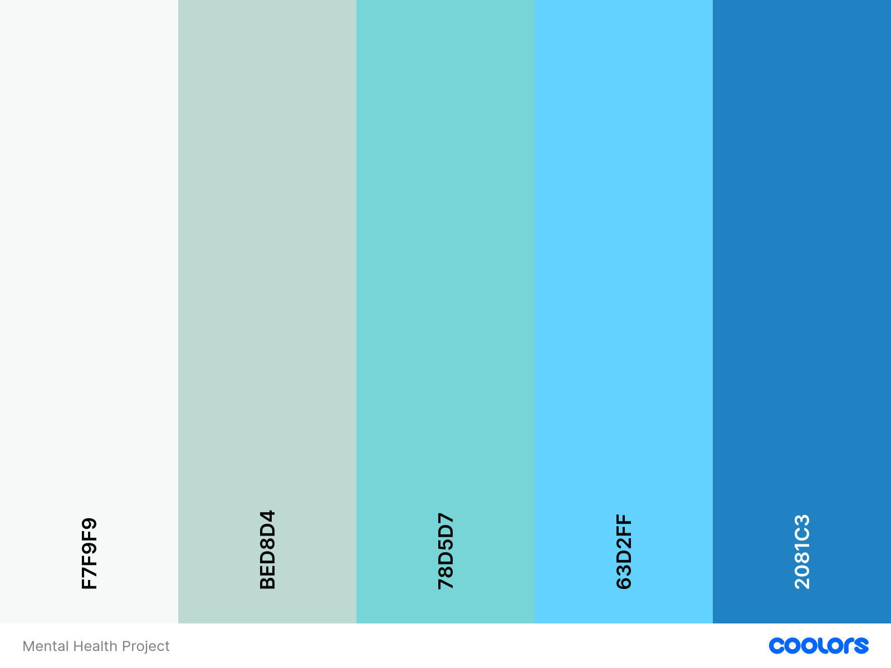

# Braincare - Portfolio Project

## Overview
___
### Purpose:
The purpose of my page is to help direct users to useful resources and services regarding mental health. I wanted to keep the landing page relatively clear so not to bombard visitors with too much information. Instead, I wanted to provide clear options to take them where they need to go.

### Target Audience:
My target audience would be anyone seeking to find advice on services or anyone who may need to quickly find numbers for urgent mental health services.

## User Stories
___
### Must-Have User Stories:

User Story 1: User 1 has experienced extremely negative thoughts and is desperate to talk to someone about it, only they don't know who to turn to. They would unlikely want to read through lots of information to find the urgent contacts and may even change their mind about seeking help.

Acceptance Criteria: Anyone in this position would be a top priority, so I feel it would make the most sense to have a link to urgent contact numbers visible from first glance at the landing page.

User Story 2: User 2 is curious about mental health and would simply like to find out more about different services and advice that they can access.

Acceptance Criteria: The landing page has 3 cards that link to pages focused on different areas of mental health, so they'll have a clearer idea of what's available.

### Should-Have User Stories:

User Story 1:
Acceptance Criteria:

User Story 2:
Acceptance Criteria:

Could-Have User Stories:

User Story 1:
Acceptance Criteria:

User Story 2:
Acceptance Criteria:

## Design Decisions
___
### Wireframes

My chosen colour scheme: I wanted to use an image of a mostly clear sky as the hero image, so I opted for similar shades of sky-like colours.

I used the mobile first development plan: I hadn't planned to, but I decided to add some simple stats about mental health at the bottom of the page, under the cards.
.png>)

I opted for the font Montserrat with a backup of sans-serif. I liked the roundness to the lettering and felt it worked nicelt with the light theme.

I didn't want there to be too much information on the landing page so used cards to describe the different areas of the site, and buttons that take them there. The first button below the hero section is the urgent button, for anyone who may have landed on the site and is in desperate need to talk to someone.

The background image for the hero section was found through a search and saved from https://wallpaperaccess.com/full/398864.jpg

### Accessibility Considerations

## Testing and Validation
___
### Testing Results
The mobile display was pretty good at first but once the screen size increased, there were issues with the cards showing correctly, side-by-side but they were different heights. Ideally, I would have like to work out how to push the button down, but I felt time was against me.

### Validation
The only issue that was hightlighted by the validation check was a suggestion that I should use a h2 or div for my emergency text. I would have changed it, but I didn't want to do something that might introduce new problems this late.

## Deployment
___
### Deployment Process
I deployed the project to Github and checked it every now and again to make sure it would work properly when viewed from a source outside of Gitpod. Thankfully, this highlighed some issues with filenames and image reference paths.

## Reflection on Development Process
___
### Successes
I opted to use the documentation for bootstrap and examples of code from our Love Running project to help with things such as structure.

### Challenges
I struggled to get started. I had the vision in my mind but I couldn't work out how to start (beyond the boilerplate). It felt like the time you get into a car without an instructor sat next to you. 

I started to place markers on the index and stylesheet so give myself some kind of path, but when I started to add things and tried to style them, nothing was behaving the way it should. I spent far too long trying to find the issue among the mess I'd set out, and became more frustrated. Eventually I decided to start from scratch.

The second attempt went to plan and I discovered that I'd copied the wrong Bootstrap code into my head. I felt so stupid for missing something so obvious, and annoyed that I had less time to complete the project as a result.

### Final Thoughts
I've learned some importnat lessons from this challenge, and I feel like I gained some self-confidence in the process. I appreciate the importance of structure when starting out, but also that I need to learn how to organise me stylesheet better.

## Future Improvements
I would have loved to implement the other pages, and fix a few issues I ran out of time for/was too afraid to change for fear of causing more issues. I think a video about mental health would have been a nice addition to the main page too.